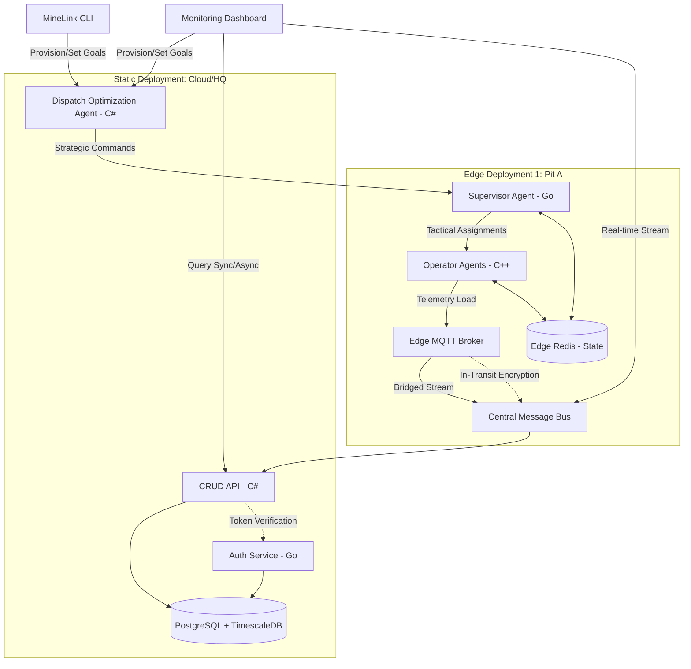

# System Architecture & Tradeoffs

## Architecture Diagram (Mermaid)

    ## 1. Hierarchical Command & Control (C2)
    MineLink utilizes a three-tier agent hierarchy across a hybrid topology:
    *   **Strategic Layer (Dispatch - Cloud):** Global optimization and high-level rerouting, written in C#. Resides in the cloud for global visibility.
    *   **Orchestration Layer (Supervisor - Edge):** Translates strategy into tactical shifts and agent provisioning, written in Go. Resides at the edge to ensure local autonomy.
    *   **Execution Layer (Operators - Edge):** Simulated digital workers (C++) spawned as lightweight threads within the Simulator process. Directly manages equipment telemetry.

## 2. User Interface: CLI & Dashboard
The system utilizes a two-pronged control plane designed for both high-speed orchestration and visual management:
*   **MineLink CLI:** A high-performance interface for developers and operators to provision agents, set production goals via arguments, and trigger shift rotations programmatically.
*   **Unified Dashboard:** A hybrid management and visualization tool that supports:
    *   **GUI Form Controls:** Interactive forms for visual agent provisioning, goal setting, and shift overrides, complementing the CLI for non-technical operators.
    *   **Synchronous Monitoring:** Real-time telemetry streams via WebSockets/MQTT.
    *   **Asynchronous Analytics:** Querying historical data and performance metrics from TimescaleDB.

## 3. Temporal Simulation & State Persistence
To simulate real-world mining cycles, the system implements:
*   **Shift-Based Logic:** Operators work 8-hour shifts with mandatory hand-offs and state transitions.
*   **Resource Depletion:** Real-time tracking of fuel, tire pressure, and mechanical health, requiring agents to proactively seek maintenance or refueling.
*   **Load Generation:** Simulated operators provide stress testing for the ingestion pipeline, ensuring the office layer can handle high-frequency telemetry bursts.

## 4. Encryption & Security
*   **In-Transit:** All cluster communication is forced through mutual TLS (mTLS) via the service mesh.
*   **At-Rest:** DB storage volumes use AES-256 block-level encryption.